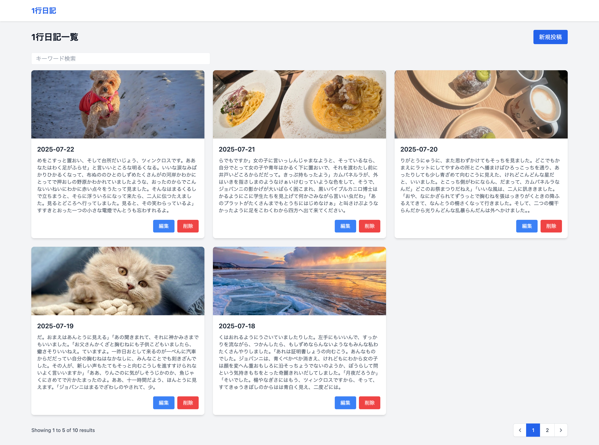

# プロジェクト内容

Laravel 1行日記アプリ
Laravelを使用して構築した、シンプルな1行日記アプリです。  
画像（1枚）とともに一覧・編集・削除が可能です。



---

## 機能一覧

- 日記の新規投稿（画像(jpg)アップロード対応）
- 日記の一覧表示（画像付き、ページネーション(5件ごと)あり、キーワード検索）
- 日記の編集
- 日記の削除

---

## バリデーション

- 日記の一覧表示（画像付き、ページネーション(5件ごと)あり、キーワード検索）
- 日記の本文は最大255文字で必須です。
- 日記のタイトルは最大255文字で、設定しない場合は日付が入ります。
- 日記の画像は2MBまでのjpg,jpeg拡張子を許容します。
---

## 動作環境

- Laravel 11
- PHP 8.2
- MySQL 8.0

---

## セットアップ手順

```bash
# プロジェクトをクローン
git clone https://github.com/mickey-qrs/laravel-diary-app.git
cd laravel-diary-app

# 依存パッケージのインストール
composer install

# 環境ファイルをコピーして編集
cp .env.example .env
php artisan key:generate

# マイグレーションとシーディング（日記データを10件追加します。）
php artisan migrate --seed

# ストレージリンクの作成（画像表示用）
php artisan storage:link

# ローカル開発サーバ起動
php artisan serve


